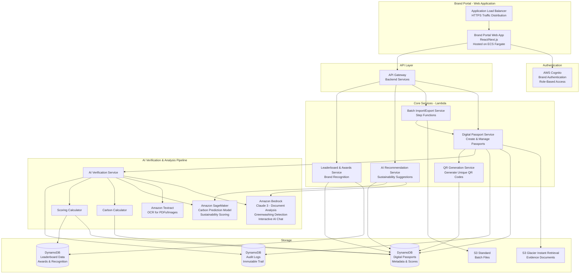
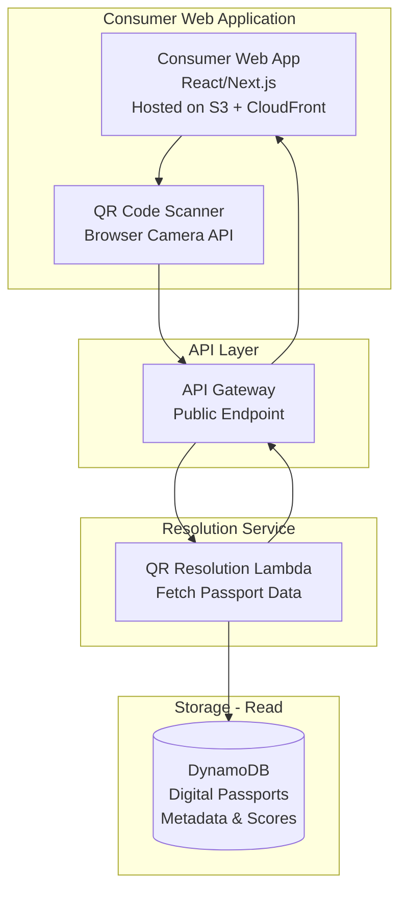
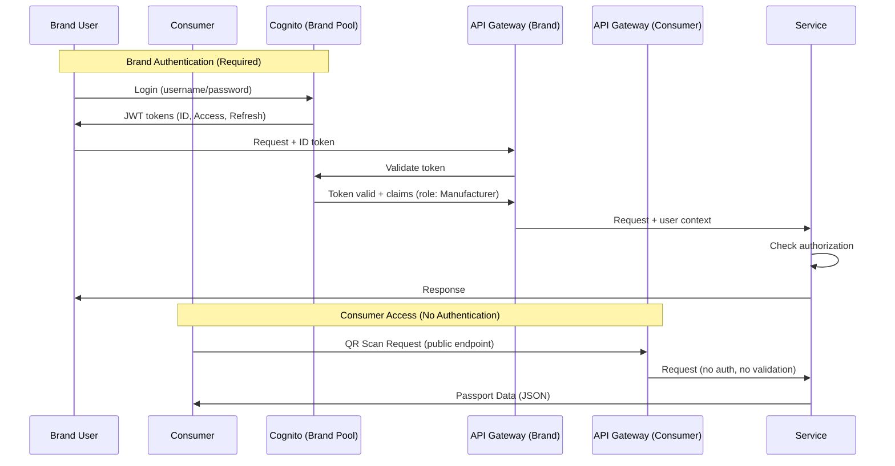
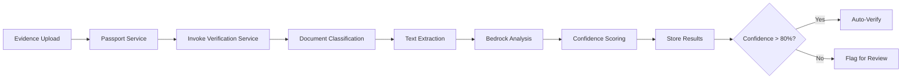

# Design Document: Green Passport

## Overview

Green Passport is an AWS-native web application providing Digital Product Passport (DPP) capabilities with verified sustainability information. The system consists of two distinct user-facing web applications:

1. **Brand Portal (Web App)**: For manufacturers to create passports, upload evidence, manage products, and generate QR codes
2. **Consumer Portal (Web/Mobile App)**: For end users to scan QR codes and view verified sustainability information

The architecture emphasizes:
- **Immutability**: All sustainability data and audit trails are append-only
- **Direct Service Communication**: Services communicate via synchronous calls or SQS queues for loose coupling
- **Real-time**: Score updates within 5 seconds, QR resolution within 2 seconds
- **Security**: Encryption at rest (KMS), TLS 1.3 in transit, role-based access control
- **Scalability**: DynamoDB-optimized access patterns, auto-scaling services
- **Separation of Concerns**: Write-heavy brand operations separated from read-heavy consumer operations

## Architecture Overview

The Green Passport system is divided into two primary scenarios:

### Scenario 1: QR Generation / Brand Side (Write-Heavy)
Allows brands/companies to submit product data, verify sustainability claims, generate Digital Passports, and create QR codes.

### Scenario 2: QR Resolution / Consumer Side (Read-Heavy)
Allows consumers to scan QR codes and retrieve Digital Passports with low latency, caching, and controlled API usage.

---

## Diagram 1: QR Generation / Brand Side



### Brand Side Flow

1. Brand accesses **Brand Portal Web App** via **Application Load Balancer (ALB)**
2. Brand logs in via **AWS Cognito** (Brand User Pool with role-based access)
3. Brand submits **product data, sustainability claims, and evidence documents**
4. **API Gateway** authenticates via **Cognito** and routes to services
5. **Digital Passport Service**:
   - Stores evidence in **S3 Glacier Instant Retrieval** (cost-efficient)
   - Creates versioned passport in **DynamoDB**
   - Records all actions in **DynamoDB Audit Log**
6. **AI Verification Service**:
   - Uses **Amazon Bedrock (Claude 3)** to analyze documents and validate claims
   - Uses **Amazon Textract** for OCR of PDFs and images
   - Uses **Amazon SageMaker** to predict missing carbon footprint metrics
   - Detects **greenwashing** and flags inconsistent claims
   - Generates **Trust Scores** and verification confidence
7. **Carbon Calculator**: Computes lifecycle emissions
8. **Scoring Calculator**: Computes sustainability score (0-100)
9. **AI Recommendation Service**:
   - Provides personalized sustainability improvement suggestions
   - Interactive AI chat for brand queries
   - Continuous learning and feedback
10. **Leaderboard & Awards Service**:
    - Ranks brands based on sustainability metrics
    - Awards badges for achievements
    - Tracks progress over time
11. **QR Generation Service**: Creates unique QR codes for products
12. **Batch Service**: Handles bulk import/export via **Step Functions**

**AWS Services**:
- Brand Portal (Web App - React/Next.js hosted on **ECS Fargate** with **ALB**)
- AWS Cognito (Brand Authentication with RBAC)
- API Gateway (Backend API)
- Lambda (Services)
- Amazon Bedrock (AI Document Analysis, Greenwashing Detection, Interactive Chat)
- Amazon Textract (OCR)
- Amazon SageMaker (Predictive Models, Sustainability Analysis)
- S3 Glacier Instant Retrieval (Evidence Storage)
- S3 Standard (Batch Files)
- DynamoDB (Passports, Metadata, QR Codes, Leaderboards, Awards)
- DynamoDB (Audit Logs)
- Step Functions (Batch Orchestration)
- CloudWatch (Monitoring and Logging)

---

## Diagram 2: QR Resolution / Consumer Side



### Consumer Side Flow

1. Consumer accesses **Consumer Web App** hosted on **S3 + CloudFront** (static hosting)
2. Consumer uses **QR Scanner** (browser camera API) to scan product QR code
3. Web app makes **API request** to **API Gateway** with QR code
4. **API Gateway** (public endpoint, no authentication) invokes **QR Resolution Lambda**
5. **Lambda function** fetches passport data from **DynamoDB**
6. **Lambda** returns **JSON payload** with passport data (sustainability score, claims, carbon footprint)
7. **API Gateway** returns response to web app
8. **Consumer Web App** displays passport information to user

**AWS Services**:
- Consumer Web App (React/Next.js hosted on S3 + CloudFront for static hosting)
- API Gateway (REST API, public endpoint)
- Lambda (QR Resolution Service)
- DynamoDB (Digital Passport Data)

**Design Notes**:
- **Simplified architecture**: Direct flow from web app → API Gateway → Lambda → DynamoDB
- **No authentication/authorization**: Completely public access, no Cognito or WAF
- **No rate limiting**: Removed for simplicity (can be added later if needed)
- **Static hosting**: Web app served from S3 + CloudFront
- **JSON API**: Lambda returns structured JSON payload with all passport data
- **Client-side rendering**: Web app handles all UI rendering and interactions

---

### Data Ownership Model

- Product data and evidence documents are owned by the brand
- Green Passport platform hosts and manages the data on behalf of brands
- Brands retain full rights to export their data at any time via batch export
- Audit logs track all access and modifications for compliance

### Architectural Principles

1. **Web Application Architecture**: Two separate web applications with distinct hosting strategies
   - **Brand Portal**: ECS Fargate with ALB for dynamic, interactive web application
   - **Consumer Portal**: S3 + CloudFront for static web app
2. **Pipeline Separation**: Write-heavy QR generation pipeline separated from read-heavy QR resolution pipeline for independent scaling
3. **Direct Service Communication**: Services communicate directly via synchronous calls or SQS queues for loose coupling
4. **Simplified Consumer Flow**: Consumer portal uses direct API Gateway → Lambda → DynamoDB flow (no authentication, no caching)
5. **AI-Powered Continuous Improvement**: Bedrock and SageMaker provide ongoing recommendations and interactive chat for brands
6. **Brand Recognition System**: Leaderboards and awards motivate sustainability improvements
7. **Cost Optimization**: S3 Glacier Instant Retrieval for evidence documents (lower storage cost, retrieval on-demand)
8. **Single Responsibility**: Each service owns a specific domain capability
9. **Immutable Data**: Audit trails and evidence documents are never modified, only appended
10. **Optimistic Locking**: DynamoDB conditional writes prevent concurrent modification conflicts
11. **Idempotent Operations**: Services use idempotency keys to safely retry operations
12. **AI-Powered Verification**: Amazon Bedrock for document analysis, greenwashing detection, and interactive guidance
13. **Flexible Schema**: DynamoDB flexible schema allows for future data model changes without migrations
14. **Public Consumer Access**: No authentication or rate limiting for consumer QR scanning

**Validates: Requirements 8.1, 8.2, 8.3, 8.4, 8.5**

## Service Decomposition

### 1. Passport Service

**Responsibility**: Create and manage product passports

**Operations**:
- `CreatePassport(productInfo, claims, manufacturerId)`: Creates new passport with pending status
- `UpdatePassport(passportId, updates, version)`: Creates new version with optimistic locking
- `GetPassport(passportId, version?)`: Retrieves current or historical version
- `UploadEvidence(passportId, claimId, file)`: Stores evidence in S3, records metadata
- `DeletePassport(passportId, manufacturerId)`: Soft delete (marks as deleted, retains in audit)
- `ExportPassportData(manufacturerId)`: Exports all passport data for a manufacturer

**Communication**:
- Invokes Verification Service directly after passport creation
- Invokes QR Generation Service after passport creation
- Publishes to SQS queue for async processing if needed

**Data Owned**:
- Product passport metadata (flexible schema)
- Sustainability claims
- Evidence document references
- Version history

**Validates: Requirements 1.1, 1.2, 1.3, 1.4, 1.5, 2.1, 2.2, 2.3, 2.4, 2.5, 12.1, 12.2, 12.3, 12.4, 12.5**

### 2. Batch Import/Export Service

**Responsibility**: Handle bulk product passport operations

**Operations**:
- `ImportPassports(fileUrl, manufacturerId)`: Imports passports from CSV/JSON file
- `ExportPassports(manufacturerId, filters)`: Exports passports to CSV/JSON file
- `GetImportStatus(jobId)`: Returns progress and errors for import job
- `GetExportStatus(jobId)`: Returns download URL when export completes

**Workflow (Step Functions)**:
```
1. Validate file format and schema
2. Parse file into individual passport records
3. For each record:
   - Validate data
   - Invoke Passport Service to create/update
   - Track success/failure
4. Generate results file with errors
5. Upload results to S3
6. Notify user via email/webhook
```

**File Formats Supported**:
- CSV: Flat structure with predefined columns
- JSON: Nested structure matching passport schema
- Maximum file size: 100 MB
- Maximum records per file: 10,000

**Data Owned**:
- Import/export job status
- Error logs and validation results

**Validates: New requirement for batch operations**

### 3. Verification Service

**Responsibility**: Coordinate AI-powered claim verification

**Operations**:
- `VerifyClaim(claimId, evidenceIds)`: Orchestrates AI analysis
- `GetVerificationStatus(claimId)`: Returns verification results and confidence
- `FlagForReview(claimId, reason)`: Marks claim for manual verifier review
- `ApproveClaimManually(claimId, verifierId)`: Manual approval by authorized verifier

**Communication**:
- Invoked by Passport Service after evidence upload
- Invokes AI Verifier Lambda for document analysis
- Invokes Carbon Calculator Service for emissions
- Invokes Scoring Service for final score calculation

**Data Owned**:
- Verification results
- Confidence scores
- Flagged claims queue

**Validates: Requirements 3.1, 3.2, 3.3, 3.4, 3.5**

### 4. AI Verifier (Lambda)

**Responsibility**: Analyze evidence documents using Amazon Textract, Bedrock, and SageMaker

**Operations**:
- `ExtractTextFromDocument(evidenceDocument)`: Uses Textract for OCR of PDFs and images
- `AnalyzeEvidence(evidenceDocument, claim)`: Extracts data, compares to claim
- `CalculateConfidence(extractedData, claim)`: Computes confidence score (0-100)
- `DetectInconsistencies(extractedData, claim)`: Identifies mismatches
- `PredictCarbonMetrics(productData)`: Uses SageMaker to predict missing carbon footprint data

**AI Model Strategy**:
- **Amazon Textract**: OCR for PDFs and images to extract text, tables, and forms
- **Amazon Bedrock with Claude 3 Sonnet**: Document understanding, claim verification, inconsistency detection
- **Amazon SageMaker**: Predictive model for estimating missing carbon footprint metrics based on product category, materials, and manufacturing processes
- Prompt engineering for structured data extraction
- Confidence scoring based on evidence quality and claim alignment

**Textract Integration**:
```python
# Extract text from PDF or image
async def extract_text_from_document(s3_key):
    response = await textract.analyze_document(
        Document={'S3Object': {'Bucket': EVIDENCE_BUCKET, 'Name': s3_key}},
        FeatureTypes=['TABLES', 'FORMS']
    )
    
    # Extract text blocks
    text = ' '.join([block['Text'] for block in response['Blocks'] if block['BlockType'] == 'LINE'])
    
    # Extract tables and forms
    tables = extract_tables(response['Blocks'])
    forms = extract_forms(response['Blocks'])
    
    return {
        'text': text,
        'tables': tables,
        'forms': forms
    }
```

**SageMaker Integration**:
```python
# Predict missing carbon metrics
async def predict_carbon_footprint(product_data):
    endpoint = 'green-passport-carbon-predictor'
    payload = {
        'category': product_data.get('category'),
        'materials': product_data.get('materials'),
        'weight': product_data.get('weight'),
        'manufacturing_country': product_data.get('manufacturing_country')
    }
    
    response = await sagemaker_runtime.invoke_endpoint(
        EndpointName=endpoint,
        ContentType='application/json',
        Body=json.dumps(payload)
    )
    
    predictions = json.loads(response['Body'].read())
    return {
        'production_emissions': predictions['production'],
        'transport_emissions': predictions['transport'],
        'confidence': predictions['confidence']
    }
```

**Validates: Requirements 3.1, 3.2, 3.3, 3.4, 3.5**

### 5. Carbon Calculator Service

**Responsibility**: Compute lifecycle carbon emissions

**Operations**:
- `CalculateLifecycleEmissions(productionData, transportData, usageData, eolData)`: Computes total footprint
- `CalculateProductionEmissions(materials, energy, processes)`: Production phase
- `CalculateTransportEmissions(distance, mode, weight)`: Distribution phase
- `CalculateUsageEmissions(powerConsumption, lifetime)`: Use phase
- `CalculateEOLEmissions(disposalMethod, recyclability)`: End-of-life phase

**Communication**:
- Invoked by Verification Service after AI analysis completes
- Returns results to Verification Service

**Calculation Methodology**:
- Use industry-standard emission factors (e.g., EPA, IPCC)
- Support multiple calculation standards (GHG Protocol, ISO 14067)
- Record methodology and factors used in audit trail

**Data Owned**:
- Carbon calculation results
- Emission factors database
- Calculation methodology records

**Validates: Requirements 4.1, 4.2, 4.3, 4.4, 4.5, 4.6**

### 6. Scoring Service

**Responsibility**: Calculate sustainability scores

**Operations**:
- `CalculateScore(passportId)`: Computes weighted score (0-100)
- `GetScoreBreakdown(passportId)`: Returns factor contributions
- `RecalculateScore(passportId)`: Triggered by data updates

**Communication**:
- Invoked by Verification Service after carbon calculation
- Invoked by Passport Service when passport data changes

**Scoring Algorithm**:
```
Score = (VerifiedClaimsWeight * VerifiedClaimsScore) +
        (CarbonFootprintWeight * CarbonScore) +
        (EvidenceQualityWeight * EvidenceScore)

Where:
- VerifiedClaimsScore: Percentage of claims verified with high confidence
- CarbonScore: Normalized inverse of carbon footprint (lower is better)
- EvidenceScore: Quality and completeness of evidence documents
- Weights sum to 1.0 (configurable)
```

**Performance Requirement**: Complete recalculation within 5 seconds

**Data Owned**:
- Current scores
- Score history
- Scoring weights configuration

**Validates: Requirements 5.1, 5.2, 5.3, 5.4, 5.5**

### 7. QR Resolution Service

**Responsibility**: Fast QR code to passport resolution

**Operations**:
- `ResolveQR(qrCode)`: Returns passport data as JSON within 2 seconds
- `GenerateQR(passportId)`: Creates unique QR code
- `RecordScan(qrCode, timestamp)`: Logs scan events (optional)

**Communication**:
- Invoked by API Gateway from consumer web app requests
- Reads directly from DynamoDB

**Resolution Flow**:
```
1. Consumer scans QR → Web app calls API Gateway
2. API Gateway invokes QR Resolution Lambda
3. Lambda queries DynamoDB by QR code (GSI lookup)
4. Lambda returns JSON payload with passport data
5. Web app displays passport information
```

**JSON Response Format**:
```json
{
  "passportId": "passport-123",
  "productName": "Eco-Friendly T-Shirt",
  "manufacturerId": "manufacturer-456",
  "sustainabilityScore": 85,
  "verificationStatus": "verified",
  "claims": [
    {
      "claimId": "claim-1",
      "claimType": "material",
      "statement": "Made from 100% organic cotton",
      "verificationStatus": "verified",
      "confidenceScore": 95
    }
  ],
  "carbonFootprint": {
    "totalEmissions": 2.5,
    "phases": {
      "production": 1.2,
      "transport": 0.8,
      "usage": 0.3,
      "endOfLife": 0.2
    }
  },
  "qrCode": "QR-ABC123",
  "createdAt": "2024-01-15T10:30:00Z",
  "updatedAt": "2024-01-20T14:45:00Z"
}
```

**Performance Requirement**: 95th percentile resolution time <2 seconds

**Data Owned**:
- QR code to passport mappings
- Scan event logs (optional)

**Validates: Requirements 6.1, 6.2, 6.3**

### 8. Audit Service

**Responsibility**: Maintain immutable audit trails

**Operations**:
- `RecordEvent(entity, action, actor, before, after)`: Appends audit entry
- `GetAuditTrail(entityId, startTime?, endTime?)`: Retrieves history
- `VerifyIntegrity(entityId)`: Validates cryptographic signatures

**Audit Entry Structure**:
```json
{
  "auditId": "uuid",
  "entityId": "passport-123",
  "entityType": "ProductPassport",
  "timestamp": "2024-01-15T10:30:00Z",
  "actor": "manufacturer-456",
  "action": "UPDATE",
  "before": {...},
  "after": {...},
  "signature": "cryptographic-signature",
  "correlationId": "request-correlation-id"
}
```

**Immutability Enforcement**:
- DynamoDB table with no update/delete permissions
- Cryptographic signatures using AWS KMS
- Append-only writes with monotonic timestamps

**Data Owned**:
- Complete audit trail for all entities

**Validates: Requirements 7.1, 7.2, 7.3, 7.4, 7.5**

### 9. AI Recommendation Service

**Responsibility**: Provide personalized sustainability improvement suggestions and interactive AI chat

**Operations**:
- `GetRecommendations(passportId)`: Analyzes product data and returns improvement suggestions
- `ChatWithAI(brandId, query)`: Interactive chat for sustainability questions
- `AnalyzeTrends(brandId)`: Identifies patterns and opportunities across brand's products
- `SuggestMaterials(productCategory, currentMaterials)`: Recommends sustainable alternatives
- `PredictImpact(proposedChanges)`: Estimates impact of potential improvements

**Communication**:
- Invoked by Brand Portal via API Gateway
- Invokes Bedrock for natural language understanding and generation
- Invokes SageMaker for predictive analytics
- Reads from DynamoDB for product history and context

**AI Model Strategy**:
- **Amazon Bedrock with Claude 3**: Interactive chat, personalized recommendations, trend analysis
- **Amazon SageMaker**: Predictive models for impact estimation and material suggestions
- **Context-aware**: Uses brand's historical data and industry benchmarks
- **Continuous learning**: Improves recommendations based on brand feedback and outcomes

**Recommendation Types**:
1. **Material Substitution**: Suggest more sustainable materials
2. **Process Optimization**: Recommend manufacturing process improvements
3. **Carbon Reduction**: Identify opportunities to reduce emissions
4. **Certification Guidance**: Suggest relevant certifications to pursue
5. **Supply Chain**: Recommend sustainable sourcing options

**Interactive AI Chat Examples**:
- "How can I reduce the carbon footprint of my cotton t-shirts?"
- "What certifications should I pursue for my electronics products?"
- "Compare the sustainability of recycled polyester vs. organic cotton"
- "What are the latest trends in sustainable packaging?"

**Data Owned**:
- Recommendation history
- Chat conversation logs
- Feedback on recommendation effectiveness

**Validates: New requirement for AI-powered continuous improvement**

### 10. Leaderboard & Awards Service

**Responsibility**: Rank brands and provide recognition for sustainability achievements

**Operations**:
- `GetLeaderboard(category?, timeframe?)`: Returns ranked list of brands
- `GetBrandRank(brandId)`: Returns specific brand's ranking and percentile
- `AwardBadge(brandId, achievementType)`: Awards badge for milestone achievement
- `GetBrandAwards(brandId)`: Returns all awards earned by a brand
- `CalculateRankings()`: Periodic recalculation of leaderboard positions

**Communication**:
- Invoked by Brand Portal via API Gateway
- Reads from DynamoDB Passport table for sustainability scores
- Writes to DynamoDB Leaderboard table
- Triggered by Scoring Service when scores are updated

**Ranking Criteria**:
1. **Overall Sustainability Score**: Weighted average across all products
2. **Improvement Rate**: Rate of score increase over time
3. **Verification Rate**: Percentage of claims verified with high confidence
4. **Carbon Reduction**: Total carbon footprint reduction achieved
5. **Product Coverage**: Percentage of product catalog with passports

**Award Types**:
- **Carbon Champion**: Achieved significant carbon reduction
- **Transparency Leader**: High verification rates and complete documentation
- **Innovation Pioneer**: Early adopter of sustainable practices
- **Continuous Improver**: Consistent score improvements over time
- **Category Leader**: Top performer in specific product category

**Leaderboard Views**:
- Global leaderboard (all brands)
- Category-specific leaderboards (e.g., apparel, electronics, food)
- Regional leaderboards
- Time-based leaderboards (monthly, quarterly, yearly)

**Data Owned**:
- Brand rankings
- Award history
- Achievement milestones
- Leaderboard snapshots

**Validates: New requirement for brand recognition and motivation**

## Domain Model

### Core Entities

**Note**: All schemas use flexible, extensible structures to accommodate future changes without migrations. DynamoDB's schemaless nature allows adding new fields without affecting existing data.

#### ProductPassport
```typescript
{
  passportId: string (PK)
  version: number (SK)
  productName: string
  manufacturerId: string
  category?: string
  // Flexible claims array - can contain any claim structure
  claims: Array<Record<string, any>>
  // Flexible carbon footprint - can add new metrics
  carbonFootprint?: Record<string, any>
  sustainabilityScore?: number
  verificationStatus: "pending" | "verified" | "flagged"
  qrCode: string
  createdAt: timestamp
  updatedAt: timestamp
  previousVersion?: number
  // Extensible metadata for future fields
  metadata?: Record<string, any>
}
```

#### SustainabilityClaim
```typescript
{
  claimId: string
  claimType: string  // Flexible - not limited to predefined types
  statement: string
  evidenceIds: string[]
  verificationStatus: "pending" | "verified" | "flagged" | "rejected"
  confidenceScore?: number
  verifiedAt?: timestamp
  verifiedBy?: string
  // Extensible for future claim attributes
  attributes?: Record<string, any>
}
```

#### EvidenceDocument
```typescript
{
  evidenceId: string (PK)
  passportId: string (GSI)
  claimId: string
  fileName: string
  fileType: string
  s3Key: string
  fileHash: string
  uploadedBy: string
  uploadedAt: timestamp
  // Flexible metadata for any document-specific data
  metadata: Record<string, any>
}
```

#### CarbonFootprint
```typescript
{
  totalEmissions: number (kg CO2e)
  // Flexible phase emissions - can add new phases
  phases: Record<string, number>  // e.g., { production: 100, transport: 50, ... }
  methodology: string
  calculatedAt: timestamp
  // Flexible input data structure
  inputData: Record<string, any>
}
```

#### AuditEntry
```typescript
{
  auditId: string (PK)
  entityId: string (GSI)
  entityType: string
  timestamp: number (SK)
  actor: string
  action: string
  // Flexible before/after to handle any entity structure
  before: any
  after: any
  signature: string
  correlationId: string
}
```

#### BatchJob
```typescript
{
  jobId: string (PK)
  manufacturerId: string (GSI)
  jobType: "import" | "export"
  status: "pending" | "processing" | "completed" | "failed"
  fileUrl: string
  totalRecords: number
  processedRecords: number
  successCount: number
  errorCount: number
  errors: Array<{recordIndex: number, error: string}>
  createdAt: timestamp
  completedAt?: timestamp
  // Flexible for job-specific metadata
  metadata?: Record<string, any>
}
```

**Schema Evolution Strategy**:
- New fields can be added without affecting existing records
- Optional fields use `?` notation
- Use `Record<string, any>` for extensible nested structures
- Versioning at the passport level tracks schema changes over time
- Application code handles missing fields gracefully with defaults

#### LeaderboardEntry
```typescript
{
  leaderboardId: string (PK)
  rank: number (SK)
  brandId: string
  brandName: string
  score: number
  improvementRate: number
  verificationRate: number
  carbonReduction: number
  awards: string[]
  category: string
  timeframe: string  // "monthly", "quarterly", "yearly", "all-time"
  calculatedAt: timestamp
}
```

#### Award
```typescript
{
  awardId: string
  brandId: string (PK)
  awardType: string (SK)
  awardName: string
  description: string
  achievedAt: timestamp
  criteria: Record<string, any>
  // Flexible metadata for award-specific data
  metadata?: Record<string, any>
}
```

#### AIRecommendation
```typescript
{
  recommendationId: string
  passportId: string
  brandId: string
  recommendationType: string  // "material", "process", "carbon", "certification", "supply_chain"
  title: string
  description: string
  estimatedImpact: {
    carbonReduction?: number
    costSavings?: number
    scoreImprovement?: number
  }
  actionItems: string[]
  priority: "high" | "medium" | "low"
  status: "pending" | "implemented" | "dismissed"
  createdAt: timestamp
  implementedAt?: timestamp
}
```

#### ChatConversation
```typescript
{
  conversationId: string (PK)
  brandId: string
  messages: Array<{
    role: "user" | "assistant"
    content: string
    timestamp: timestamp
  }>
  context: {
    passportIds?: string[]
    topic?: string
  }
  createdAt: timestamp
  updatedAt: timestamp
}
```

**Validates: Requirements 1.1, 2.1, 4.5, 7.1, 12.1, 27.1, 28.1**

## Service Communication Patterns

### Synchronous Communication

**Direct Lambda Invocation**:
- Passport Service → Verification Service
- Verification Service → AI Verifier
- Verification Service → Carbon Calculator
- Verification Service → Scoring Service

**API Gateway REST Calls**:
- Brand Portal → Passport Service
- Consumer App → QR Resolution Service

### Asynchronous Communication

**SQS Queues**:
```
PassportProcessingQueue:
  - Producer: Passport Service
  - Consumer: Verification Service
  - Use case: Decouple passport creation from verification
  - Visibility timeout: 300 seconds
  - Dead letter queue: PassportProcessingDLQ

BatchProcessingQueue:
  - Producer: Batch Service
  - Consumer: Passport Service
  - Use case: Process bulk imports without blocking
  - Batch size: 10 messages
  - Visibility timeout: 600 seconds
```

**Step Functions**:
- Batch Import/Export orchestration
- Long-running verification workflows
- Retry logic for failed operations

### Communication Flow

```
Passport Creation Flow:
1. Brand Portal → API Gateway → Passport Service (sync)
2. Passport Service → S3 (evidence upload)
3. Passport Service → DynamoDB (save passport)
4. Passport Service → SQS (async verification trigger)
5. SQS → Verification Service (async)
6. Verification Service → AI Verifier (sync)
7. Verification Service → Carbon Calculator (sync)
8. Verification Service → Scoring Service (sync)
9. Scoring Service → DynamoDB (update score)
10. Passport Service → QR Generation Service (sync)
```

**Idempotency**:
- All services accept idempotency keys in request headers
- DynamoDB conditional writes prevent duplicate processing
- SQS message deduplication for async operations

**Validates: Requirements 8.1, 8.2, 8.3, 8.4, 8.5**

## Data Storage Strategy

### DynamoDB Table Design

#### PassportTable
```
PK: PASSPORT#{passportId}
SK: VERSION#{version}

GSI1:
  PK: MANUFACTURER#{manufacturerId}
  SK: CREATED#{timestamp}

GSI2:
  PK: QR#{qrCode}
  SK: PASSPORT#{passportId}

Attributes: passportId, version, productName, manufacturerId, claims, 
            carbonFootprint, sustainabilityScore, verificationStatus, 
            qrCode, createdAt, updatedAt
```

**Access Patterns**:
1. Get passport by ID (latest version): Query PK=PASSPORT#{id}, SK begins_with VERSION, limit 1, descending
2. Get passport by ID (specific version): Get PK=PASSPORT#{id}, SK=VERSION#{v}
3. List passports by manufacturer: Query GSI1 PK=MANUFACTURER#{id}
4. Resolve QR code: Query GSI2 PK=QR#{code}

#### EvidenceTable
```
PK: EVIDENCE#{evidenceId}
SK: METADATA

GSI1:
  PK: PASSPORT#{passportId}
  SK: UPLOADED#{timestamp}

Attributes: evidenceId, passportId, claimId, fileName, fileType, 
            s3Key, fileHash, uploadedBy, uploadedAt, metadata
```

#### AuditTable
```
PK: ENTITY#{entityId}
SK: TIMESTAMP#{timestamp}

Attributes: auditId, entityId, entityType, timestamp, actor, action, 
            before, after, signature, correlationId
```

**Time-to-Live**: Not enabled (immutable audit trail)

#### BatchJobTable
```
PK: JOB#{jobId}
SK: METADATA

GSI1:
  PK: MANUFACTURER#{manufacturerId}
  SK: CREATED#{timestamp}

Attributes: jobId, manufacturerId, jobType, status, fileUrl, 
            totalRecords, processedRecords, successCount, errorCount,
            errors, createdAt, completedAt, metadata (flexible)
```

**Access Patterns**:
1. Get job by ID: Get PK=JOB#{id}, SK=METADATA
2. List jobs by manufacturer: Query GSI1 PK=MANUFACTURER#{id}
3. Update job progress: Update PK=JOB#{id}, SK=METADATA with atomic counters

#### LeaderboardTable
```
PK: LEADERBOARD#{category}#{timeframe}
SK: RANK#{rank}

GSI1:
  PK: BRAND#{brandId}
  SK: CATEGORY#{category}

Attributes: brandId, brandName, rank, score, improvementRate, 
            verificationRate, carbonReduction, awards, 
            calculatedAt, category, timeframe
```

**Access Patterns**:
1. Get leaderboard: Query PK=LEADERBOARD#{category}#{timeframe}, limit N
2. Get brand rank: Query GSI1 PK=BRAND#{id}, SK begins_with CATEGORY
3. Get top performers: Query PK=LEADERBOARD#{category}#{timeframe}, SK begins_with RANK, limit 10

#### AwardsTable
```
PK: BRAND#{brandId}
SK: AWARD#{awardType}#{timestamp}

Attributes: awardId, brandId, awardType, awardName, description,
            achievedAt, criteria, metadata
```

**Access Patterns**:
1. Get brand awards: Query PK=BRAND#{id}
2. Get recent awards: Query PK=BRAND#{id}, SK begins_with AWARD, limit N, descending

### S3 Bucket Design

#### Evidence Bucket
```
Bucket: green-passport-evidence-{env}
Structure: /{passportId}/{claimId}/{evidenceId}/{filename}
Storage Class: S3 Glacier Instant Retrieval (cost-optimized)
Encryption: SSE-KMS with customer-managed key
Versioning: Enabled
Lifecycle: Transition to Glacier Deep Archive after 2 years
```

**Rationale**: Evidence documents are infrequently accessed (only during verification and on-demand consumer requests). Glacier Instant Retrieval provides millisecond retrieval with 68% cost savings vs. S3 Standard.

#### Batch Import/Export Bucket
```
Bucket: green-passport-batch-{env}
Structure: 
  /imports/{manufacturerId}/{jobId}/{filename}
  /exports/{manufacturerId}/{jobId}/{filename}
Storage Class: S3 Standard (frequent access during processing)
Encryption: SSE-KMS with customer-managed key
Versioning: Disabled
Lifecycle: Delete after 30 days
```

**Rationale**: Batch files are temporary and accessed frequently during processing. Auto-delete after 30 days to reduce storage costs.

### Caching Strategy

**Consumer Portal**:
- **No server-side caching**: Direct DynamoDB queries for simplicity
- **Client-side caching**: Browser caches API responses using standard HTTP cache headers
- **CloudFront**: Serves static web app assets (HTML, CSS, JS) with long TTL

**Brand Portal**:
- **No caching**: Real-time data for manufacturers and verifiers
- **CloudFront**: Serves static web app assets only

**Cache Headers for API Responses**:
```
Cache-Control: public, max-age=300, s-maxage=300
```
- Allows browsers to cache passport data for 5 minutes
- Reduces API calls for repeated QR scans of same product

**Validates: Requirements 2.1, 2.2, 2.3, 2.4, 10.1, 10.3, 11.4**

## Security Architecture

### Authentication Flow

The system uses one Cognito user pool for the Brand Portal only:
- **Brand User Pool**: For manufacturers, verifiers, and administrators (required authentication)
- **Consumer Portal**: No authentication - completely public access



**Brand Portal Authentication**:
- AWS Cognito User Pool with custom attributes for roles
- JWT tokens (ID, Access, Refresh) for session management
- Lambda authorizer validates tokens on API Gateway
- Role-based access control (Manufacturer, Verifier, Administrator)

**Consumer Portal Authentication**:
- No authentication required
- Public API endpoints
- No user accounts or sessions
- No rate limiting or WAF (simplified for public access)

### Authorization Model

**Roles**:
- **Manufacturer**: Create/update own passports, upload evidence, export own data
- **Verifier**: Review flagged claims, manually approve/reject
- **Administrator**: Full system access, manage users, view all audit trails
- **Consumer**: Read-only public access to verified passports (no authentication required)

**Permission Matrix**:

| Operation | Manufacturer | Verifier | Administrator | Consumer (Public) |
|-----------|--------------|----------|---------------|-------------------|
| Create Passport | Own only | No | Yes | No |
| Update Passport | Own only | No | Yes | No |
| Upload Evidence | Own only | No | Yes | No |
| View Passport | Own + Public | All | All | Public only |
| Verify Claim | No | Yes | Yes | No |
| View Audit Trail | Own only | Flagged only | All | No |
| Manage Users | No | No | Yes | No |
| Batch Import/Export | Own only | No | Yes | No |
| Scan QR Code | N/A | N/A | N/A | Yes |

**Implementation**:
- One Cognito user pool for Brand Portal (Manufacturer, Verifier, Administrator roles)
- Brand pool: Custom attributes for roles
- API Gateway Lambda authorizer validates JWT and extracts roles for Brand API
- Consumer API: Public endpoints with no authentication, no WAF, no rate limiting
- Services enforce fine-grained permissions using policy documents for Brand Portal only

**Data Ownership**:
- Manufacturers own their product data and evidence
- Platform hosts data on behalf of manufacturers
- Manufacturers can export all their data at any time
- Audit logs track all access for compliance

**Validates: Requirements 9.1, 9.2, 9.3, 9.4, 9.5**

### Encryption Strategy

**At Rest**:
- DynamoDB: AWS-managed KMS key per table
- S3: Customer-managed KMS key for evidence bucket
- Key rotation: Automatic annual rotation

**In Transit**:
- TLS 1.3 for all API Gateway endpoints
- Certificate management via AWS Certificate Manager
- Enforce HTTPS-only with redirect from HTTP

**Validates: Requirements 10.1, 10.2, 10.3, 10.4, 10.5**

## AI Verification Design

### Document Analysis Pipeline



### Bedrock Integration

**Model Selection**: Claude 3 Sonnet for document understanding

**Prompt Template**:
```
You are analyzing a sustainability evidence document to verify a claim.

Claim: {claim_statement}
Claim Type: {claim_type}

Document Content:
{extracted_text}

Tasks:
1. Extract all relevant data points that relate to the claim
2. Determine if the evidence supports, contradicts, or is insufficient for the claim
3. Identify any inconsistencies or red flags
4. Provide a confidence score (0-100) for claim validity

Respond in JSON format:
{
  "extracted_data": {...},
  "verdict": "supports" | "contradicts" | "insufficient",
  "confidence": 0-100,
  "reasoning": "...",
  "red_flags": [...]
}
```

### Confidence Scoring Algorithm

```python
def calculate_confidence(verdict, evidence_quality, claim_specificity):
    base_score = {
        "supports": 80,
        "insufficient": 40,
        "contradicts": 10
    }[verdict]
    
    # Adjust for evidence quality
    quality_multiplier = evidence_quality / 100  # 0-1
    
    # Adjust for claim specificity (specific claims easier to verify)
    specificity_bonus = claim_specificity * 10  # 0-10
    
    final_score = (base_score * quality_multiplier) + specificity_bonus
    return min(100, max(0, final_score))
```

**Thresholds**:
- Confidence ≥ 80: Auto-verify
- Confidence 50-79: Flag for manual review
- Confidence < 50: Auto-reject

**Validates: Requirements 3.1, 3.2, 3.3, 3.4, 3.5**

## Versioning & Immutability Model

### Passport Versioning

**Strategy**: Copy-on-write with version numbers

```typescript
// Creating new version
async function updatePassport(passportId: string, updates: Partial<Passport>) {
  // 1. Get current version
  const current = await getLatestVersion(passportId);
  
  // 2. Create new version
  const newVersion = {
    ...current,
    ...updates,
    version: current.version + 1,
    previousVersion: current.version,
    updatedAt: Date.now()
  };
  
  // 3. Write with conditional check (optimistic locking)
  await dynamodb.put({
    Item: newVersion,
    ConditionExpression: 'attribute_not_exists(PK) AND attribute_not_exists(SK)'
  });
  
  // 4. Publish event
  await eventBridge.publish({
    type: 'passport.updated',
    data: { passportId, version: newVersion.version }
  });
  
  return newVersion;
}
```

### Audit Trail Immutability

**Enforcement Mechanisms**:
1. **IAM Policies**: No UpdateItem or DeleteItem permissions on AuditTable
2. **Cryptographic Signatures**: Each entry signed with KMS key
3. **Append-Only Pattern**: Only PutItem operations allowed
4. **Monotonic Timestamps**: Reject entries with timestamps ≤ latest entry

**Signature Generation**:
```typescript
async function signAuditEntry(entry: AuditEntry): Promise<string> {
  const payload = JSON.stringify({
    entityId: entry.entityId,
    timestamp: entry.timestamp,
    actor: entry.actor,
    action: entry.action,
    before: entry.before,
    after: entry.after
  });
  
  const signature = await kms.sign({
    KeyId: AUDIT_KEY_ID,
    Message: Buffer.from(payload),
    SigningAlgorithm: 'RSASSA_PKCS1_V1_5_SHA_256'
  });
  
  return signature.Signature.toString('base64');
}
```

**Validates: Requirements 7.1, 7.2, 7.3, 7.4, 7.5, 12.1, 12.2, 12.3, 12.4, 12.5**

## Scalability Strategy

### Pipeline-Specific Scaling

**QR Generation Pipeline (Write-Heavy)**:
- ECS Fargate: Auto-scales Brand Portal web app based on CPU/memory utilization
- ALB: Distributes traffic across ECS tasks
- Lambda concurrency: 100 reserved for Passport Service
- SQS: Handles 10,000+ messages/second
- DynamoDB: On-demand capacity for unpredictable write patterns
- S3 Glacier: Unlimited storage, auto-scales

**QR Resolution Pipeline (Read-Heavy)**:
- CloudFront: Serves static Consumer web app globally
- Lambda: Auto-scales based on API Gateway requests
- DynamoDB: On-demand capacity with GSI for QR code lookups
- API Gateway: Public endpoint, no rate limiting

### Auto-Scaling Configuration

**ECS Fargate (Brand Portal)**:
- Target tracking scaling policy
- Target CPU utilization: 70%
- Target memory utilization: 80%
- Min tasks: 2 (Multi-AZ for high availability)
- Max tasks: 20
- Scale-out cooldown: 60 seconds
- Scale-in cooldown: 300 seconds

**Lambda Functions**:
- Reserved concurrency: 100 per critical function (QR Resolution, Passport Service)
- Provisioned concurrency: 10 for QR Resolution (warm starts)
- Memory: 1024 MB for AI Verifier, 512 MB for others
- Timeout: 30s for AI Verifier, 10s for others

**DynamoDB**:
- On-demand capacity mode for unpredictable traffic
- Auto-scaling for provisioned mode (if cost-optimized):
  - Target utilization: 70%
  - Min capacity: 5 RCU/WCU
  - Max capacity: 1000 RCU/WCU

**API Gateway**:
- Brand API: Default throttle: 10,000 requests/second with Lambda authorizer
- Consumer API: No throttle limits (public access)
- Burst: 5,000 requests

**CloudFront**:
- Automatic scaling to handle traffic spikes
- Global edge locations for static web app delivery
- Compress responses (gzip/brotli)

**DynamoDB**:
- On-demand capacity mode for automatic scaling
- GSI for QR code lookups (O(1) access)
- No DAX or caching layers for simplicity

**Application Load Balancer (Brand Portal)**:
- Cross-zone load balancing enabled
- Connection draining: 300 seconds
- Health checks: HTTP /health endpoint every 30 seconds
- Unhealthy threshold: 2 consecutive failures
- Healthy threshold: 2 consecutive successes

**Validates: Requirements 11.1, 11.2, 11.3, 11.4, 11.5**

## Failure Handling Strategy

### Retry Policies

**SQS Queues**:
- Maximum retry attempts: 3
- Exponential backoff: 1s, 2s, 4s
- Dead-letter queue: Separate DLQ per queue
- DLQ alarm: CloudWatch alert on message count > 10
- Message retention: 14 days

**Lambda**:
- Async invocation retry: 2 attempts
- SQS trigger: Message visibility timeout = 6x function timeout
- DLQ: Separate queue per function
- Timeout handling: Graceful shutdown with state preservation

**Step Functions**:
- Automatic retry with exponential backoff
- Catch blocks for error handling
- Fallback workflows for critical failures

### Circuit Breaker Pattern

```typescript
class CircuitBreaker {
  private failureCount = 0;
  private lastFailureTime = 0;
  private state: 'CLOSED' | 'OPEN' | 'HALF_OPEN' = 'CLOSED';
  
  async execute<T>(operation: () => Promise<T>): Promise<T> {
    if (this.state === 'OPEN') {
      if (Date.now() - this.lastFailureTime > RESET_TIMEOUT) {
        this.state = 'HALF_OPEN';
      } else {
        throw new Error('Circuit breaker is OPEN');
      }
    }
    
    try {
      const result = await operation();
      this.onSuccess();
      return result;
    } catch (error) {
      this.onFailure();
      throw error;
    }
  }
  
  private onSuccess() {
    this.failureCount = 0;
    this.state = 'CLOSED';
  }
  
  private onFailure() {
    this.failureCount++;
    this.lastFailureTime = Date.now();
    
    if (this.failureCount >= FAILURE_THRESHOLD) {
      this.state = 'OPEN';
    }
  }
}
```

### Graceful Degradation

**QR Resolution**:
- Primary: DynamoDB with GSI lookup
- Fallback: Return cached error page if DynamoDB unavailable
- Client-side retry: Web app retries failed requests with exponential backoff

**Scoring**:
- If Carbon Service unavailable: Use last known carbon footprint
- If Verification Service unavailable: Use existing verification status
- Mark score as "partial" when computed with fallback data

**Validates: Requirements 11.1, 11.2, 11.3**


## Correctness Properties

A property is a characteristic or behavior that should hold true across all valid executions of a system—essentially, a formal statement about what the system should do. Properties serve as the bridge between human-readable specifications and machine-verifiable correctness guarantees.

### Property 1: Passport Creation Completeness

*For any* product information with sustainability claims submitted by a manufacturer, creating a passport should result in a unique passport ID, a unique QR code that resolves to that passport, an initialized audit trail with a creation event, and an initial verification status of "pending".

**Validates: Requirements 1.1, 1.3, 1.4, 1.5**

### Property 2: Evidence Requirement Enforcement

*For any* passport creation attempt, if any sustainability claim lacks at least one evidence document, the system should reject the creation request.

**Validates: Requirements 1.2**

### Property 3: Evidence Encryption and Immutability

*For any* evidence document uploaded, the document should be encrypted at rest using KMS, and all subsequent uploads (including replacements) should preserve previous versions with their metadata recorded in the audit trail.

**Validates: Requirements 2.1, 2.2, 2.4, 10.3**

### Property 4: Evidence Metadata Recording

*For any* evidence document upload, the audit trail should contain an entry with upload timestamp, file hash, and uploader identity.

**Validates: Requirements 2.3**

### Property 5: Evidence Format Support

*For any* evidence document in PDF, image (PNG, JPG), CSV, or JSON format, the system should accept and store the document successfully.

**Validates: Requirements 2.5**

### Property 6: AI Verification Confidence Scoring

*For any* evidence document submitted with a sustainability claim, the AI verifier should extract relevant data, compare it against the claim, and generate a confidence score between 0 and 100.

**Validates: Requirements 3.1, 3.2**

### Property 7: Inconsistency Flagging

*For any* claim where the AI verifier detects inconsistencies between evidence and the claim statement, the system should flag the claim for manual review.

**Validates: Requirements 3.3**

### Property 8: Verification Audit Trail

*For any* completed AI verification, the audit trail should contain an entry with verification results and confidence scores.

**Validates: Requirements 3.4**

### Property 9: Insufficient Evidence Detection

*For any* sustainability claim, if the provided evidence is missing key data points or insufficient to validate the claim, the AI verifier should identify and report this insufficiency.

**Validates: Requirements 3.5**

### Property 10: Carbon Lifecycle Aggregation

*For any* product with manufacturing, transportation, usage, and end-of-life data provided, the total carbon footprint should equal the sum of emissions from all four lifecycle phases.

**Validates: Requirements 4.1, 4.2, 4.3, 4.4, 4.5**

### Property 11: Carbon Calculation Audit Trail

*For any* carbon calculation performed, the audit trail should contain an entry with the calculation methodology and all input data used.

**Validates: Requirements 4.6**

### Property 12: Sustainability Score Range

*For any* product passport with complete verification and carbon calculations, the computed sustainability score should be a number between 0 and 100 (inclusive).

**Validates: Requirements 5.1**

### Property 13: Score Weighting Correctness

*For any* product passport, the sustainability score should reflect the weighted contribution of verified claims, carbon footprint, and evidence quality according to the configured weights.

**Validates: Requirements 5.2**

### Property 14: Score Breakdown Completeness

*For any* computed sustainability score, the system should provide a breakdown showing each contributing factor, and the sum of weighted contributions should equal the total score.

**Validates: Requirements 5.4**

### Property 15: Score Verification Status Display

*For any* sustainability score displayed, the system should include the current verification status (verified, pending, or flagged).

**Validates: Requirements 5.5**

### Property 16: QR Resolution Data Completeness

*For any* valid QR code scanned, the resolution response should include the current sustainability score, all verified claims, and the carbon footprint.

**Validates: Requirements 6.2**

### Property 17: QR Scan Audit Trail

*For any* QR code scan, the audit trail should contain an entry with the scan timestamp and location (if provided).

**Validates: Requirements 6.3**

### Property 18: Invalid QR Error Handling

*For any* QR code that references a non-existent or deleted product passport, the resolution attempt should return an error message indicating the passport cannot be found.

**Validates: Requirements 6.4**

### Property 19: Audit Trail Immutability

*For any* change made to a product passport, an immutable audit entry should be appended, and any attempt to delete or modify existing audit entries should be rejected by the system.

**Validates: Requirements 7.1, 7.3**

### Property 20: Audit Entry Completeness

*For any* modification to a product passport, the audit trail entry should contain actor identity, timestamp, change type, previous values, and new values.

**Validates: Requirements 7.2**

### Property 21: Audit Trail Chronological Ordering

*For any* audit trail query for a given entity, the returned entries should be ordered by timestamp in ascending chronological order.

**Validates: Requirements 7.4**

### Property 22: Audit Entry Cryptographic Integrity

*For any* audit trail entry created, the entry should include a cryptographic signature that can be verified using the system's KMS key.

**Validates: Requirements 7.5**

### Property 23: Service Communication Completeness

*For any* passport creation, passport update, claim verification, or carbon calculation completion, the system should invoke or queue the appropriate downstream services (QR generation, scoring, audit logging) with correlation IDs for traceability.

**Validates: Requirements 8.1, 8.2, 8.3, 8.5**

### Property 24: Asynchronous Processing

*For any* request that triggers asynchronous processing via SQS, the request should complete and return a response before the queued processing finishes (non-blocking behavior).

**Validates: Requirements 8.4**

### Property 25: Role-Based Authorization

*For any* action attempted by a user, the system should verify the user has the required role (Manufacturer, Verifier, Administrator, or Consumer) before allowing the action to proceed.

**Validates: Requirements 9.2**

### Property 26: Manufacturer Ownership Enforcement

*For any* manufacturer attempting to modify a product passport, the system should verify the manufacturer's identity matches the passport's owner before allowing the modification.

**Validates: Requirements 9.3**

### Property 27: Verifier Privilege Enforcement

*For any* claim approval attempt, the system should verify the user has verifier privileges before allowing the approval.

**Validates: Requirements 9.4**

### Property 28: Public Consumer Access

*For any* consumer attempting to view a product passport, the system should allow access without requiring authentication.

**Validates: Requirements 9.5**

### Property 29: Passport Versioning Preservation

*For any* product passport update, the system should create a new version with an incremented version number while preserving the previous version, and both versions should be retrievable.

**Validates: Requirements 12.1, 12.3**

### Property 30: Latest Version Default Retrieval

*For any* product passport query without a specific version number, the system should return the version with the highest version number.

**Validates: Requirements 12.2**

### Property 31: Version Linking in Audit Trail

*For any* new passport version created, the audit trail should contain an entry that links the new version to the previous version number.

**Validates: Requirements 12.4**

### Property 32: Version History Authorization

*For any* request to view version history, the system should display the history only if the requesting user is authorized (passport owner or administrator).

**Validates: Requirements 12.5**

## Error Handling

### Error Categories

**Validation Errors** (4xx):
- Missing required fields
- Invalid data formats
- Evidence requirement violations
- Authorization failures

**System Errors** (5xx):
- DynamoDB throttling
- S3 upload failures
- AI service unavailability
- Event publishing failures

### Error Response Format

```json
{
  "error": {
    "code": "EVIDENCE_REQUIRED",
    "message": "Each sustainability claim must have at least one evidence document",
    "details": {
      "claimId": "claim-123",
      "claimType": "material"
    },
    "timestamp": "2024-01-15T10:30:00Z",
    "requestId": "req-uuid"
  }
}
```

### Retry Strategy

**Transient Errors**:
- DynamoDB throttling: Exponential backoff (100ms, 200ms, 400ms)
- S3 5xx errors: Retry up to 3 times
- AI service timeout: Retry with increased timeout

**Permanent Errors**:
- Validation errors: No retry, return immediately
- Authorization errors: No retry, return immediately
- Not found errors: No retry, return immediately

### Dead Letter Queue Processing

**DLQ Monitoring**:
- CloudWatch alarm on message count > 10
- SNS notification to operations team
- Automated replay for transient failures after 1 hour

**Manual Intervention**:
- Review failed events in DLQ
- Identify root cause (data issue vs. system issue)
- Fix and replay or discard

## Testing Strategy

### Dual Testing Approach

The Green Passport system requires both unit testing and property-based testing for comprehensive coverage:

**Unit Tests**: Focus on specific examples, edge cases, and error conditions
- Specific passport creation scenarios
- Edge cases (empty strings, null values, boundary conditions)
- Error handling paths
- Integration points between services
- Mock external dependencies (Bedrock, KMS, S3)

**Property-Based Tests**: Verify universal properties across all inputs
- Generate random product data, claims, and evidence
- Test properties hold for 100+ randomized iterations
- Discover edge cases through randomization
- Validate invariants and business rules

### Property-Based Testing Configuration

**Framework**: Use `fast-check` for TypeScript/JavaScript services

**Test Configuration**:
- Minimum 100 iterations per property test
- Seed randomization for reproducibility
- Shrinking enabled to find minimal failing cases

**Test Tagging**: Each property test must reference its design property:
```typescript
// Feature: green-passport, Property 1: Passport Creation Completeness
test('passport creation includes all required fields', async () => {
  await fc.assert(
    fc.asyncProperty(
      productInfoArbitrary(),
      claimsArbitrary(),
      async (productInfo, claims) => {
        const passport = await createPassport(productInfo, claims);
        expect(passport.passportId).toBeDefined();
        expect(passport.qrCode).toBeDefined();
        expect(passport.verificationStatus).toBe('pending');
        const auditTrail = await getAuditTrail(passport.passportId);
        expect(auditTrail[0].action).toBe('CREATE');
      }
    ),
    { numRuns: 100 }
  );
});
```

### Test Data Generators

**Arbitraries for Property Tests**:
```typescript
// Product information generator
const productInfoArbitrary = () => fc.record({
  productName: fc.string({ minLength: 1, maxLength: 200 }),
  category: fc.constantFrom('electronics', 'apparel', 'food', 'furniture'),
  manufacturerId: fc.uuid()
});

// Sustainability claim generator
const claimArbitrary = () => fc.record({
  claimType: fc.constantFrom('material', 'energy', 'water', 'waste', 'social'),
  statement: fc.string({ minLength: 10, maxLength: 500 }),
  evidenceIds: fc.array(fc.uuid(), { minLength: 1, maxLength: 5 })
});

// Evidence document generator
const evidenceArbitrary = () => fc.record({
  fileName: fc.string({ minLength: 1, maxLength: 100 }),
  fileType: fc.constantFrom('pdf', 'png', 'jpg', 'csv', 'json'),
  content: fc.uint8Array({ minLength: 100, maxLength: 10000 })
});

// Carbon data generator
const carbonDataArbitrary = () => fc.record({
  productionEmissions: fc.float({ min: 0, max: 10000 }),
  transportEmissions: fc.float({ min: 0, max: 5000 }),
  usageEmissions: fc.float({ min: 0, max: 20000 }),
  eolEmissions: fc.float({ min: 0, max: 2000 })
});
```

### Integration Testing

**Service Integration**:
- Test event flow between services using LocalStack
- Verify DynamoDB access patterns with test data
- Test S3 encryption with KMS
- Mock Bedrock responses for AI verification

**End-to-End Scenarios**:
1. Complete passport lifecycle (create → upload evidence → verify → calculate → score → scan)
2. Version update flow (create → update → verify both versions exist)
3. Authorization flow (attempt unauthorized access → verify rejection)
4. Error recovery (simulate failures → verify retry and DLQ behavior)

### Performance Testing

**Load Testing**:
- Simulate 10,000 concurrent QR scans
- Measure 95th percentile latency
- Verify auto-scaling triggers correctly

**Stress Testing**:
- Test DynamoDB throttling behavior
- Test Lambda concurrency limits
- Test S3 upload throughput

**Benchmarks**:
- QR resolution: <2 seconds (95th percentile)
- Score recalculation: <5 seconds
- API response: <500ms for reads

## Traceability Matrix

| Requirement | Design Component | Correctness Property |
|-------------|------------------|---------------------|
| 1.1 | Passport Service: CreatePassport | Property 1 |
| 1.2 | Passport Service: Validation | Property 2 |
| 1.3 | Passport Service: CreatePassport, QR Service | Property 1 |
| 1.4 | Audit Service: RecordEvent | Property 1 |
| 1.5 | Passport Service: CreatePassport | Property 1 |
| 2.1 | S3 Bucket: SSE-KMS | Property 3 |
| 2.2 | S3 Bucket: Versioning | Property 3 |
| 2.3 | Audit Service: RecordEvent | Property 4 |
| 2.4 | S3 Bucket: Versioning, Audit Service | Property 3 |
| 2.5 | Passport Service: UploadEvidence | Property 5 |
| 3.1 | AI Verifier: AnalyzeEvidence | Property 6 |
| 3.2 | AI Verifier: CalculateConfidence | Property 6 |
| 3.3 | Verification Service: FlagForReview | Property 7 |
| 3.4 | Audit Service: RecordEvent | Property 8 |
| 3.5 | AI Verifier: DetectInconsistencies | Property 9 |
| 4.1 | Carbon Calculator: CalculateProductionEmissions | Property 10 |
| 4.2 | Carbon Calculator: CalculateTransportEmissions | Property 10 |
| 4.3 | Carbon Calculator: CalculateUsageEmissions | Property 10 |
| 4.4 | Carbon Calculator: CalculateEOLEmissions | Property 10 |
| 4.5 | Carbon Calculator: CalculateLifecycleEmissions | Property 10 |
| 4.6 | Audit Service: RecordEvent | Property 11 |
| 5.1 | Scoring Service: CalculateScore | Property 12 |
| 5.2 | Scoring Service: Scoring Algorithm | Property 13 |
| 5.3 | Scoring Service: RecalculateScore (Performance) | N/A - Performance Test |
| 5.4 | Scoring Service: GetScoreBreakdown | Property 14 |
| 5.5 | Scoring Service: CalculateScore | Property 15 |
| 6.1 | QR Service: ResolveQR (Performance) | N/A - Performance Test |
| 6.2 | QR Service: ResolveQR | Property 16 |
| 6.3 | QR Service: RecordScan, Audit Service | Property 17 |
| 6.4 | QR Service: ResolveQR Error Handling | Property 18 |
| 6.5 | API Gateway: TLS Configuration | N/A - Infrastructure |
| 7.1 | Audit Service: RecordEvent | Property 19 |
| 7.2 | Audit Service: Audit Entry Structure | Property 20 |
| 7.3 | Audit Service: Immutability Enforcement | Property 19 |
| 7.4 | Audit Service: GetAuditTrail | Property 21 |
| 7.5 | Audit Service: Signature Generation | Property 22 |
| 8.1 | Service Communication: Direct Invocation/SQS | Property 23 |
| 8.2 | Service Communication: Direct Invocation/SQS | Property 23 |
| 8.3 | Service Communication: Direct Invocation/SQS | Property 23 |
| 8.4 | SQS: Async Processing | Property 24 |
| 8.5 | Service Communication: Correlation IDs | Property 23 |
| 9.1 | Cognito: Authentication | N/A - Infrastructure |
| 9.2 | API Gateway: Lambda Authorizer | Property 25 |
| 9.3 | Passport Service: Authorization | Property 26 |
| 9.4 | Verification Service: Authorization | Property 27 |
| 9.5 | API Gateway: Public Endpoints | Property 28 |
| 10.1 | DynamoDB: KMS Encryption | N/A - Infrastructure |
| 10.2 | API Gateway: TLS Configuration | N/A - Infrastructure |
| 10.3 | S3 Bucket: SSE-KMS | Property 3 |
| 10.4 | API Gateway: TLS Configuration | N/A - Infrastructure |
| 10.5 | KMS: Key Rotation | N/A - Operational |
| 11.1 | QR Service: Optimization Strategy | N/A - Performance Test |
| 11.2 | Scoring Service: RecalculateScore | N/A - Performance Test |
| 11.3 | Auto-Scaling Configuration | N/A - Performance Test |
| 11.4 | DynamoDB: Access Patterns | N/A - Performance Test |
| 11.5 | Auto-Scaling Configuration | N/A - Infrastructure |
| 12.1 | Passport Service: Versioning | Property 29 |
| 12.2 | Passport Service: GetPassport | Property 30 |
| 12.3 | Passport Service: GetPassport | Property 29 |
| 12.4 | Audit Service: RecordEvent | Property 31 |
| 12.5 | Passport Service: Authorization | Property 32 |


## Web Application UI/UX Design

### Application Structure

Green Passport consists of two separate web applications:
1. **Brand Portal**: For manufacturers, verifiers, and administrators
2. **Consumer Portal**: For end users to view product sustainability information

---

## Brand Portal - Pages & Features

### 1. Authentication Pages

#### 1.1 Login Page
- Email/password login
- "Remember me" checkbox
- "Forgot password" link
- Social login options (Google, Microsoft)
- Clean, professional design with Green Passport branding

#### 1.2 Registration Page
- Company information form
- User details (name, email, role)
- Terms of service acceptance
- Email verification flow

#### 1.3 Password Reset
- Email input for reset link
- Reset confirmation page
- New password creation form

---

### 2. Dashboard (Home Page)

#### 2.1 Overview Cards
- Total products with passports
- Pending verifications count
- Average sustainability score
- Recent QR scans (last 30 days)

#### 2.2 Quick Actions
- Create new passport (prominent CTA button)
- Upload batch file
- View pending verifications
- Export data

#### 2.3 Recent Activity Feed
- Latest passport creations
- Verification status updates
- QR scan activity
- System notifications

#### 2.4 Analytics Charts
- Sustainability score distribution (histogram)
- Verification status breakdown (pie chart)
- QR scans over time (line chart)
- Top scanned products (bar chart)

---

### 3. Product Passports Management

#### 3.1 Passports List Page
**Features**:
- Searchable, filterable, sortable table
- Columns: Product Name, Category, Score, Status, Created Date, Actions
- Filters: Status (pending/verified/flagged), Category, Score range, Date range
- Bulk actions: Export selected, Delete selected
- Pagination (50 items per page)
- List/Grid view toggle

**Table Actions**:
- View details (eye icon)
- Edit (pencil icon)
- View QR code (QR icon)
- Download QR (download icon)
- View history (clock icon)
- Delete (trash icon)

#### 3.2 Create Passport Page
**Multi-step Form**:

**Step 1: Product Information**
- Product name (required)
- Category dropdown (required)
- Description (rich text editor)
- Product images (drag-and-drop upload, max 5)
- Manufacturing location
- Product weight
- Materials used (multi-select)

**Step 2: Sustainability Claims**
- Add multiple claims (dynamic form)
- For each claim:
  - Claim type (dropdown: material, energy, water, waste, social, custom)
  - Claim statement (textarea)
  - Upload evidence documents (drag-and-drop, multiple files)
  - Evidence description
- "Add another claim" button
- Minimum 1 claim required

**Step 3: Carbon Footprint Data (Optional)**
- Production emissions input
- Transportation data (distance, mode, weight)
- Usage parameters (power consumption, lifetime)
- End-of-life data (disposal method, recyclability)
- Auto-prediction option (uses SageMaker if data missing)

**Step 4: Review & Submit**
- Summary of all entered data
- Preview of passport
- Edit buttons for each section
- Submit button (creates passport and triggers verification)

**Progress Indicator**: Visual stepper showing current step

#### 3.3 Passport Details Page
**Layout**: Two-column layout

**Left Column**:
- Product images carousel
- Product information card
- Sustainability score (large, prominent display with color coding)
  - 80-100: Green
  - 60-79: Yellow
  - 0-59: Red
- Score breakdown (expandable sections)
- QR code display with download button
- Share buttons (copy link, email, social media)

**Right Column**:
- Verification status badge
- Claims list with verification status
- Evidence documents (downloadable)
- Carbon footprint visualization (lifecycle chart)
- Version history (expandable)
- Audit trail (expandable, filterable by action type)

**Actions Bar**:
- Edit passport
- Add evidence
- Request re-verification
- Export PDF
- Delete passport

#### 3.4 Edit Passport Page
- Same form as create, pre-populated with existing data
- Version number displayed
- "Save as new version" button
- "Cancel" returns to details page

---

### 4. Batch Operations

#### 4.1 Batch Import Page
**Features**:
- File upload area (drag-and-drop)
- Supported formats: CSV, JSON
- Download template buttons (CSV template, JSON template)
- File format instructions (expandable)
- Upload button
- Recent imports list (status, date, records processed, errors)

#### 4.2 Batch Import Progress Page
- Progress bar (percentage complete)
- Real-time status updates
- Records processed counter
- Success/error counters
- Error log (expandable table)
- Download error report button
- Cancel import button (if still processing)

#### 4.3 Batch Export Page
**Features**:
- Export filters:
  - Date range picker
  - Status filter (multi-select)
  - Category filter (multi-select)
  - Score range slider
- Export format selection (CSV, JSON, PDF)
- Include options (checkboxes):
  - Evidence documents
  - Audit trail
  - QR codes
- Export button
- Recent exports list (download links, expiry dates)

---

### 5. Verification Management (Verifier Role)

#### 5.1 Verification Queue Page
**Features**:
- Flagged claims list (table view)
- Columns: Product, Claim, Flagged Reason, AI Confidence, Date, Actions
- Filters: Confidence range, Date range, Claim type
- Sort by: Date, Confidence, Priority
- Claim details modal (click to expand)

#### 5.2 Claim Review Page
**Layout**: Split view

**Left Panel**:
- Claim statement (highlighted)
- Evidence documents viewer
  - PDF viewer
  - Image viewer
  - Table data viewer
- AI analysis results:
  - Extracted data
  - Confidence score
  - Inconsistencies detected
  - Reasoning

**Right Panel**:
- Verification form:
  - Approve/Reject radio buttons
  - Confidence override (slider 0-100)
  - Verifier notes (textarea)
  - Submit button
- Product context:
  - Product name and image
  - Other claims for this product
  - Manufacturer information

---

### 6. Analytics & Reports

#### 6.1 Analytics Dashboard
**Widgets** (customizable layout):
- Sustainability score trends (line chart)
- Verification success rate (gauge chart)
- Top performing products (leaderboard)
- Category breakdown (pie chart)
- QR scan heatmap (geographic map)
- Consumer engagement metrics
- Carbon footprint trends

**Filters** (apply to all widgets):
- Date range picker
- Category filter
- Product filter

#### 6.2 Reports Page
**Pre-built Reports**:
- Sustainability performance report
- Verification audit report
- Consumer engagement report
- Carbon footprint report

**For each report**:
- Description
- Date range selector
- Format selection (PDF, Excel, CSV)
- Generate button
- Schedule recurring reports (optional)

---

### 7. Settings

#### 7.1 Company Profile
- Company name
- Logo upload
- Industry/sector
- Contact information
- Billing information

#### 7.2 User Management (Admin only)
- Users list table
- Add user button
- Columns: Name, Email, Role, Status, Last Login, Actions
- Edit user modal (change role, deactivate)
- Invite user modal (email, role selection)

#### 7.3 Scoring Configuration (Admin only)
- Scoring weights sliders:
  - Verified claims weight (0-100%)
  - Carbon footprint weight (0-100%)
  - Evidence quality weight (0-100%)
  - Total must equal 100%
- Save button
- Reset to defaults button

#### 7.4 Notification Preferences
- Email notifications (checkboxes):
  - Verification complete
  - Claim flagged
  - Batch import complete
  - Weekly summary
- In-app notifications (checkboxes)
- Notification frequency (dropdown)

#### 7.5 API Keys (Admin only)
- API key list
- Generate new key button
- Revoke key button
- API documentation link

---

## Consumer Portal - Pages & Features

### 1. Home Page

#### 1.1 Hero Section
- Headline: "Verify Sustainability Claims Instantly"
- Subheadline: "Scan QR codes to see verified environmental impact"
- CTA button: "Scan a Product" (opens QR scanner)
- Hero image/animation showing QR scanning

#### 1.2 How It Works Section
- 3-step process:
  1. Scan QR code on product
  2. View verified sustainability data
  3. Make informed purchasing decisions
- Icons and brief descriptions

#### 1.3 Featured Products
- Carousel of high-scoring products
- Product image, name, score badge
- Click to view details

#### 1.4 Impact Statistics
- Total products verified
- Total carbon footprint tracked
- Brands participating
- Animated counters

---

### 2. QR Scanner Page

#### 2.1 Scanner Interface
- Camera viewfinder (full screen)
- QR code targeting overlay
- Instructions: "Point camera at QR code"
- Manual entry option (input field for QR code)
- Flash toggle button
- Close button (returns to home)

#### 2.2 Scanning States
- Scanning (animated)
- Success (checkmark animation)
- Error (error message with retry button)

---

### 3. Product Passport View Page

#### 3.1 Header Section
- Product image (large, prominent)
- Product name
- Sustainability score (large, color-coded badge)
- Share buttons (copy link, social media)
- Save to favorites button (if authenticated)

#### 3.2 Score Breakdown Section
- Visual breakdown (donut chart or progress bars)
- Verified claims score
- Carbon footprint score
- Evidence quality score
- Expandable details for each factor

#### 3.3 Sustainability Claims Section
- List of claims with verification badges
- For each claim:
  - Claim statement
  - Verification status (verified/pending/flagged)
  - Confidence score
  - "View evidence" button (opens modal)

#### 3.4 Carbon Footprint Section
- Lifecycle visualization (Sankey diagram or bar chart)
- Production emissions
- Transportation emissions
- Usage emissions
- End-of-life emissions
- Total carbon footprint (kg CO2e)
- Comparison to category average (if available)

#### 3.5 Product Information Section
- Category
- Manufacturer
- Manufacturing location
- Materials used
- Product weight

#### 3.6 Evidence Documents Section (Optional)
- List of evidence documents
- Document type icons
- View/download buttons
- Thumbnails for images

#### 3.7 Verification History Section
- Timeline of verification events
- Date, action, verifier (if applicable)
- Version history (if multiple versions)

---

### 4. Search & Browse

#### 4.1 Search Page
- Search bar (prominent)
- Search suggestions (as you type)
- Recent searches (if authenticated)
- Popular searches

#### 4.2 Search Results Page
- Results count
- Filters sidebar:
  - Category (checkboxes)
  - Score range (slider)
  - Manufacturer (checkboxes)
  - Verified status (checkboxes)
- Sort options: Relevance, Score (high to low), Score (low to high), Newest
- Results grid:
  - Product image
  - Product name
  - Score badge
  - Category
  - Click to view details

#### 4.3 Browse by Category Page
- Category cards (grid layout)
- Category icon, name, product count
- Click to view products in category

---

### 5. User Account (Optional Authentication)

#### 5.1 Sign Up / Login Page
- Email/password or social login
- "Continue as guest" option
- Benefits of creating account:
  - Save favorite products
  - View scan history
  - Get personalized recommendations

#### 5.2 Profile Page
- User information
- Edit profile button
- Change password button
- Delete account button

#### 5.3 Favorites Page
- Grid of saved products
- Remove from favorites button
- Empty state: "No favorites yet"

#### 5.4 Scan History Page
- List of previously scanned products
- Date and time of scan
- Product image, name, score
- Click to view details
- Clear history button

---

### 6. About & Information Pages

#### 6.1 About Page
- Mission statement
- How Green Passport works
- Team information
- Contact information

#### 6.2 FAQ Page
- Searchable FAQ
- Categories: For Consumers, For Brands, Technical
- Expandable Q&A items

#### 6.3 Privacy Policy Page
- Standard privacy policy content
- Data collection and usage
- User rights

#### 6.4 Terms of Service Page
- Standard terms of service content

---

## UI/UX Design Principles

### Visual Design

**Color Palette**:
- Primary: Green (#2ECC71) - sustainability, trust
- Secondary: Blue (#3498DB) - technology, reliability
- Accent: Orange (#E67E22) - calls-to-action
- Neutral: Grays (#ECF0F1, #95A5A6, #34495E)
- Success: Green (#27AE60)
- Warning: Yellow (#F39C12)
- Error: Red (#E74C3C)

**Typography**:
- Headings: Inter or Poppins (modern, clean)
- Body: Open Sans or Roboto (readable)
- Monospace: Fira Code (for code/data)

**Iconography**:
- Use consistent icon set (e.g., Heroicons, Feather Icons)
- Icons should be simple, recognizable
- Use icons with labels for clarity

### Interaction Design

**Micro-interactions**:
- Button hover states (subtle scale/color change)
- Loading spinners for async operations
- Success/error toast notifications
- Smooth page transitions
- Skeleton screens for loading states

**Feedback**:
- Immediate visual feedback for all actions
- Clear error messages with actionable solutions
- Success confirmations for important actions
- Progress indicators for multi-step processes

**Accessibility**:
- WCAG 2.1 AA compliance
- Keyboard navigation support
- Screen reader compatibility
- Sufficient color contrast (4.5:1 minimum)
- Focus indicators
- Alt text for images
- ARIA labels where needed

### Responsive Design

**Breakpoints**:
- Mobile: 320px - 767px
- Tablet: 768px - 1023px
- Desktop: 1024px+

**Mobile-First Approach**:
- Design for mobile first, enhance for larger screens
- Touch-friendly targets (minimum 44x44px)
- Simplified navigation for mobile
- Collapsible sections to reduce scrolling

### Performance

**Optimization**:
- Lazy loading for images and heavy components
- Code splitting for faster initial load
- Optimized images (WebP format, responsive sizes)
- Caching strategies for static assets
- Minimize bundle size

**Loading States**:
- Skeleton screens for content loading
- Progress bars for file uploads
- Spinners for quick operations
- Optimistic UI updates where appropriate

### Navigation

**Brand Portal**:
- Sidebar navigation (collapsible on mobile)
- Top bar: Logo, search, notifications, user menu
- Breadcrumbs for deep navigation
- Persistent navigation across pages

**Consumer Portal**:
- Top navigation bar (hamburger menu on mobile)
- Sticky header on scroll
- Bottom navigation bar on mobile (Home, Scan, Search, Profile)
- Back button for deep navigation

### Forms

**Best Practices**:
- Clear labels above inputs
- Placeholder text for examples
- Inline validation (real-time feedback)
- Error messages below fields
- Required field indicators (*)
- Help text for complex fields
- Autofocus on first field
- Tab order follows visual order

### Data Visualization

**Charts & Graphs**:
- Use appropriate chart types for data
- Interactive tooltips on hover
- Responsive charts (adapt to screen size)
- Color-blind friendly palettes
- Export options (PNG, SVG, CSV)

### Empty States

**Guidelines**:
- Friendly illustrations
- Clear explanation of why it's empty
- Call-to-action to populate
- Examples: "No products yet. Create your first passport!"

### Error Handling

**Error Pages**:
- 404: "Page not found" with navigation options
- 500: "Something went wrong" with retry button
- Network error: "Connection lost" with retry button
- Friendly, non-technical language
- Helpful suggestions

---

## Technical Implementation Notes

### Frontend Framework
- **Recommended**: React with Next.js (SSR/SSG for SEO)
- **Alternative**: Vue.js with Nuxt.js

### UI Component Library
- **Recommended**: Tailwind CSS + Headless UI
- **Alternative**: Material-UI, Chakra UI, Ant Design

### State Management
- **Recommended**: React Context + React Query (for server state)
- **Alternative**: Redux Toolkit, Zustand

### Routing
- Next.js App Router (file-based routing)
- Protected routes for authenticated pages

### Authentication
- AWS Amplify for Cognito integration
- JWT token management
- Automatic token refresh

### API Integration
- Axios or Fetch for HTTP requests
- API client with interceptors for auth headers
- Error handling middleware

### QR Code
- **Scanner**: react-qr-reader or html5-qrcode
- **Generator**: qrcode.react or qrcode

### Charts
- **Recommended**: Recharts or Chart.js
- **Alternative**: D3.js for custom visualizations

### File Upload
- react-dropzone for drag-and-drop
- Progress tracking for large files
- Client-side validation (file type, size)

### Hosting
- **Brand Portal**: S3 + CloudFront
- **Consumer Portal**: S3 + CloudFront
- **CI/CD**: GitHub Actions or AWS CodePipeline

---

## Page Flow Diagrams

### Brand Portal User Flow

```
Login → Dashboard → [Choose Action]
                    ├─ Create Passport → Multi-step Form → Passport Details
                    ├─ View Passports → Passports List → Passport Details
                    ├─ Batch Import → Upload File → Progress → Results
                    ├─ Verification Queue → Review Claim → Submit Decision
                    ├─ Analytics → View Reports
                    └─ Settings → Configure
```

### Consumer Portal User Flow

```
Home → [Choose Action]
       ├─ Scan QR → Scanner → Passport View
       ├─ Search → Results → Passport View
       ├─ Browse → Category → Results → Passport View
       └─ Login (Optional) → Profile/Favorites/History
```

---

## Wireframe Priorities

### High Priority (MVP)
1. Brand Portal: Dashboard, Create Passport, Passports List, Passport Details
2. Consumer Portal: Home, QR Scanner, Passport View
3. Authentication pages for both portals

### Medium Priority
1. Brand Portal: Batch Import/Export, Verification Queue
2. Consumer Portal: Search, Browse by Category
3. Settings pages

### Low Priority
1. Advanced analytics and reports
2. User account features (favorites, history)
3. API key management

---

This UI/UX plan provides a comprehensive foundation for building beautiful, user-friendly dashboards and web applications for the Green Passport system. The design emphasizes clarity, ease of use, and accessibility while maintaining a professional, trustworthy appearance appropriate for sustainability verification.
